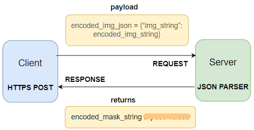

# Apparel_Extraction

`Unable to find "that" red top, even after scrolling for hours? We've got you covered. Image search is here :)`

In Apparel_Extraction, Semantic Segmentation is performed on image to obtain masked cloth region which is later categorised corresponding to different
class indices or used for IMAGE SEARCH !

### Dataset

[Original Dataset Link](https://www.kaggle.com/c/imaterialist-fashion-2019-FGVC6/data)

performed two main modifications to the dataset:

(a) 13,200 images are chosen from a total 50,000 images.

(b) Original dataset contains 46 clothing categories which are narrowed down to 4 classes viz., Background, UpperBody, WholeBody, LowerBody. Code for same is included in dataset_creation folder

### Web API

Using streamlit web application is developed and deployed using heroku platform. Everytime application is accessed, api request is sent to AWS EC2 instance where Trained Model is stored. Image uploded by user in web app is sent to EC2 instance, later processing is performed on image to output segmentation mask. This mask is returned as response of api request and is displayed in web application.

 

(Linux t2.medium instance was used for experimentation which costs $0.0552 on hourly basis.)

### File Structure

- Training/Training.ipynb 

- Testing/Testing.ipynb

- dataset_creation
  - change_file_name_to_serial_numbers.py
  - creating_seg_mask.py

- web_application
  - app
    - app.py
    - call_api.py 
 - images (Contains images deployed on heroku. These images are used as input if option
selected in sidebar of web application is “Try with inbuilt test image”)
 - requirements.txt (List of all the dependencies required to run an application in Heroku’s dynos environment)
 - .gitignore and .sluignore
 - Procfile (File containing explicit declaration of command to run application)
 - runtime.txt (Includes Python version to be installed while creating dyno)
 - setup.sh (Script written to check verified login access while deploying application to heroku)
 - Decode_mask and ip_encode

- aws_ec2/app.py (Python file containing testing code and routes code (written using flask) stored on AWS EC2 instance. This is accessed by web application when api request is sent)

### Results

Right side contains original images and left side has segmentation mask of corresponding images. With these results model achieved accuracy of 93.34%. We have used pixelwise accuracy as a metric for evaluating performance of model on test dataset. Using detected class ids, category of class is identified.

 

